# XY Utilities
Utilities for working with "XY data" in LabVIEW

- [Getting Started](#getting-started)
- [Usage](#usage)
  - [Arithmetic Functions](#arithmetic-functions)
  - [Array Functions](#array-functions)
  - [Signal Processing](#signal-processing)
  - [Waveform Conversion](#waveform-conversion)
- [Examples](#examples)
- [Contributing](#contributing)
- [License](#license)

## Getting Started
Download and install using the VI Package Manager as described [here](https://levylabpitt.github.io/)

Video tutorials: [1](https://youtu.be/eSvicCe4rxI) [2](https://youtu.be/vsgaZ0WJEis)

## Usage

The primitive datatype is "XY-data", a cluster containing an X and Y array:

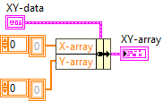

Arrays of XY-data are also supported:

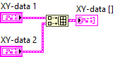

### Arithmetic Functions
#### Add.vi

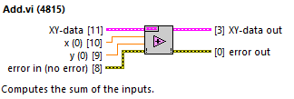

#### Subtract.vi

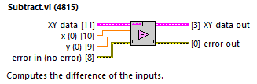

#### Multiply.vi

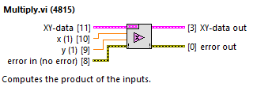

#### Divide.vi

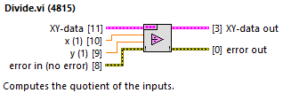

#### Square.vi

### Array Functions
#### Reverse.vi

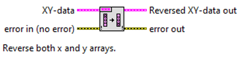

#### Sort.vi

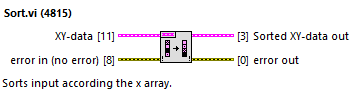

#### Decimate.vi

#### Decimate Array.vi

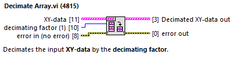

#### Swap X and Y.vi

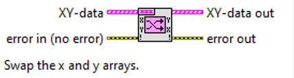

#### Get X and Y.vi

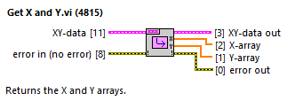

##### Append.vi

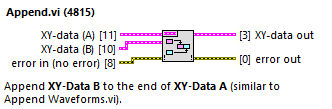

### Signal Processing
#### Derivative.vi

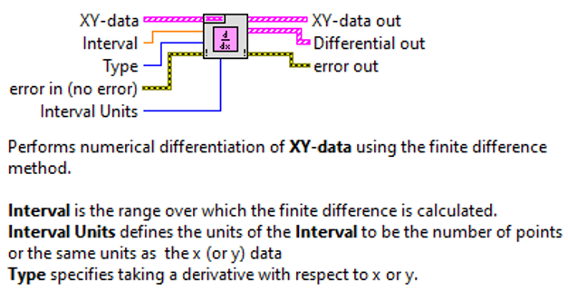

#### Resample.vi

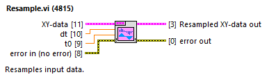

#### Interpolate.vi

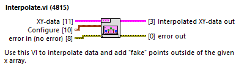

#### Interpolate Y.vi

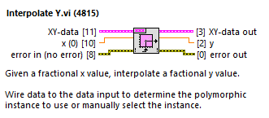

#### Interpolate Parameter.vi

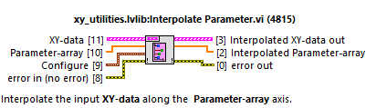

#### Average.vi

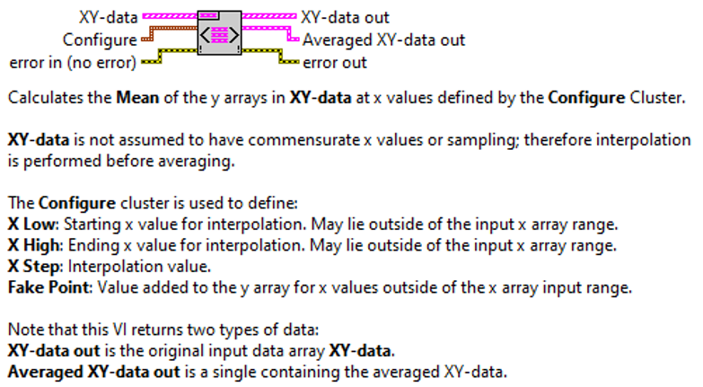

#### FFT Spectrum.vi

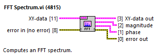

#### FFT Power Spectrum.vi

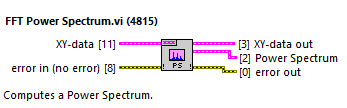

#### Shift Zero.vi

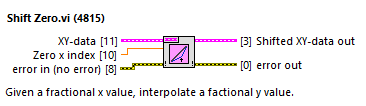

##$# Symmetrize.vi

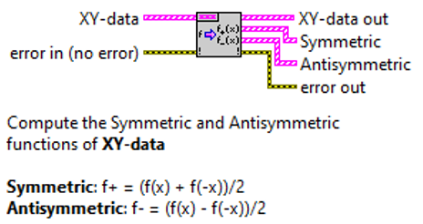

### Waveform Conversion

#### Waveform to XY.vi

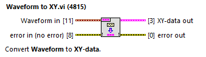

#### XY to Waveform.vi

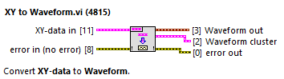

## Examples

### Tree.vi

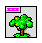

**Tree.vi** shows all of the subVIs contained in the xy_utilities.lvlib library. It also displays the equivalent LabVIEW primitive VI (for example xy_utilities.lvlib:Sort.vi is equivalent to Sort 1D Array).

#### Arithemtic Functions

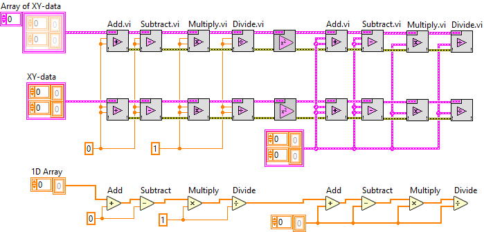

#### Array Functions

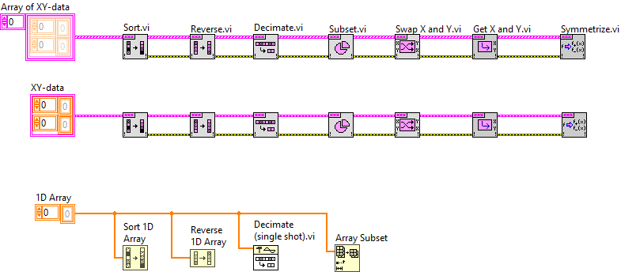

#### Signal Processing

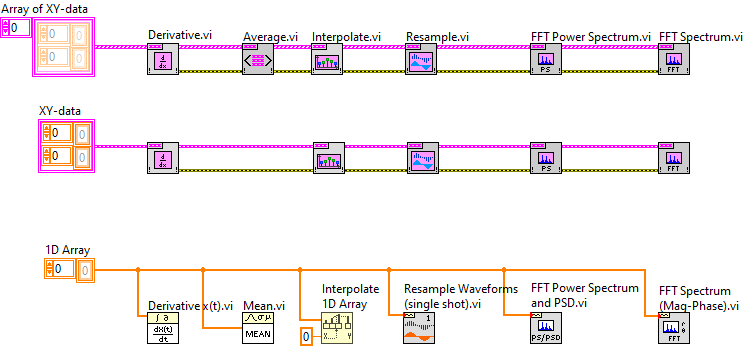

#### Waveform Conversion

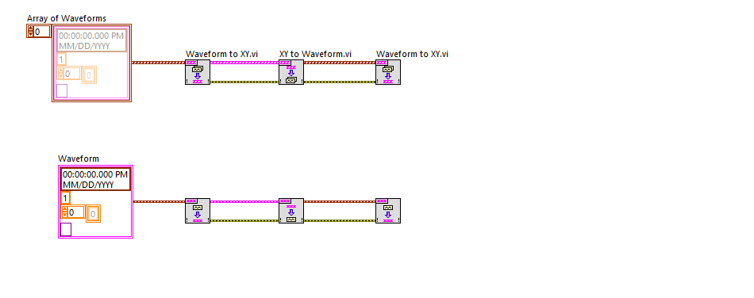

### Test.vi

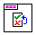

**Test.vi** is a JKI State Machine that demonstrates how to build a signal processing application with scripted states.

## Contributing
Please contact [Patrick Irvin](https://github.com/ciozi137)

## License
[BSD-3](https://opensource.org/licenses/BSD-3-Clause)
